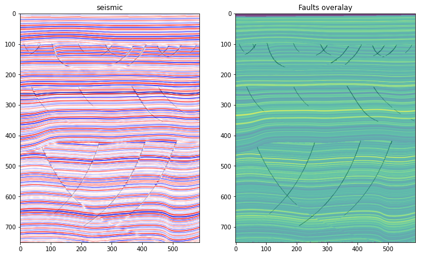

# CNN_based_Seismic_Fault_Prediction
Using synthetic seismic data

**Author**: [Suman Gautam](mailto:smngeo@gmail.com)

## Overview

This is an ongoing project on building a deep learning learning models to accurately detect fault from seismic images. You may also find my blogpost posted in Towards Data Science for an early result of this project at : 
[Medium blogpost](https://towardsdatascience.com/seismic-fault-prediction-with-deep-learning-2935704c9b48)


## Introduction
Seismic images provides a structural snapshot of Earth's subsurface at a given time. Because of the many geological and tectonic processes, the Earth's layers are folded and faulted. A seismic fault is basically a crack in the rock layers along with the block of rocks/sediments moves. If the displacemnt is large enought, they are visible in the seismic data. These faults are of primary interest in hydrocarbon exploration because they can trap oil in places or may act as conduit for oil to escape. They also pose significant hazard in drilling process and therefore a correct identification and mapping of faults is critical. 


## Data

The synthetic data were taken from FORCE competition provided by XEEK.ai.
To get more information, follow the link at [XEEK.ai](https://xeek.ai/challenges/force-seismic/overview)

An example of a seismic images with fault overlay:



## Model

The introductory data exploration will be provided in a separate notebook while the machine learning models will be provided under each type of the machine learning framework name.
The current model uses a simple U-Net framework using PyTorch implementation: 


## Results
The example below are taken randomly from 3 different epochs. Within 20 epochs, the model starts to pick faults effectively.


## For More Information

See the Data Exploration in the [Data Exploration](./Data_exploration.ipynb)
See the UNet model in the [U-Net_Model](./Pytorch_based_UNet_Model_v2.ipynb)


## Repository Structure

```
├── Overview
├── images 
├── notebook_versions
├── Data_exploration
├── Pytorch_based_UNet_Model_versions.ipynb
└── README.md
```
